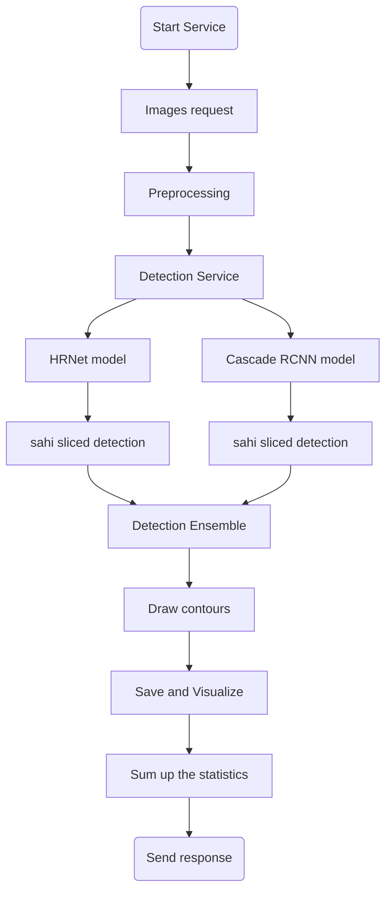

# habarovsk_hack
Данная ветка содержит реализацию сервиса с моделями детекции с использование ```MMdetection, Flask, Docker```

## Описание решения 
Мы реализовали сервис с моделями детекции, который производит подсчет моржей на лежбище по принятым изображениям
Структурно наше решение можно представить следующим образом

### Подробное описание Detection Service
Мы провели ряд экспериментов с разными архитектурами и подходами в обучении моделей детекции. Одной из особенностей данной задачи является проблема детекции мелких объектов на ```high resolution``` изображениях. Подходы к решению данной проблемы рассмотрены в ряде статей:
- HRDNet: High-resolution Detection Network for Small Objects - https://arxiv.org/pdf/2006.07607.pdf
- Small Object Detection using Deep Learning - https://arxiv.org/pdf/2201.03243.pdf \
После изучения данной проблемы и полученных данных мы решили провести эксперименты и мы подсчитывали кастомную метрику:
```
Здесь будет формула для подсчета метрики
```
| model | method/arch  | custom_metric |
| :---: | :-: | :-: |
| Cascade + ResNet-50 | RFP  | 100  |
| Cascade + ResNet-50 | SAC  | 100  |
| Cascade R-CNN | HRNet  | 100  |
| FCOS | HRNet  | 100  |
| Faster R-CNN | FPN  | 100  |
