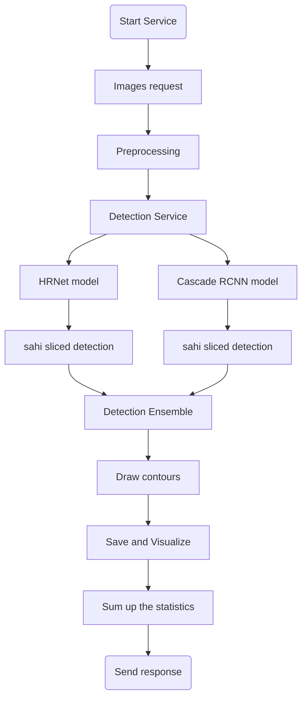
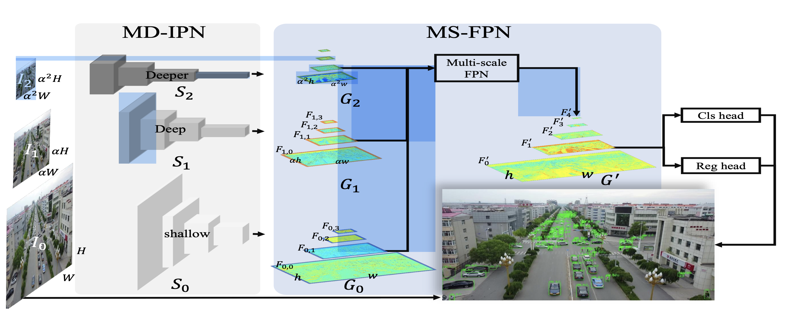
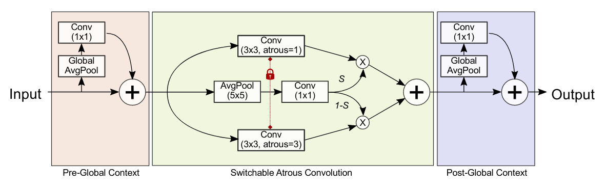
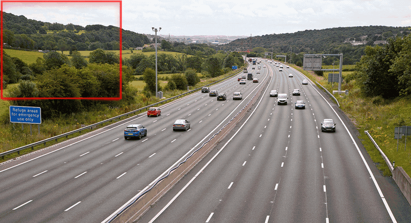

# habarovsk_hack
Данная ветка содержит реализацию сервиса с моделями детекции с использование ```MMdetection, Flask, Docker```

## Описание решения 
Мы реализовали сервис с моделями детекции, который производит подсчет моржей на лежбище по принятым изображениям
Структурно наше решение можно представить следующим образом

### Подробное описание Detection Service
Мы провели ряд экспериментов с разными архитектурами и подходами в обучении моделей детекции. Одной из особенностей данной задачи является проблема детекции мелких объектов на ```high resolution``` изображениях. Подходы к решению данной проблемы рассмотрены в ряде статей:
- HRDNet: High-resolution Detection Network for Small Objects - https://arxiv.org/pdf/2006.07607.pdf
- Small Object Detection using Deep Learning - https://arxiv.org/pdf/2201.03243.pdf \
После изучения данной проблемы и полученных данных мы решили провести эксперименты и мы подсчитывали кастомную метрику:
```
Здесь будет формула для подсчета метрики
```
| model | method/arch  |
| :---: | :-: | :-: |
| Cascade + ResNet-50 | RFP  |
| Cascade + ResNet-50 | SAC  |
| Cascade R-CNN | HRNet  |
| FCOS | HRNet  |
| Faster R-CNN | FPN  |
| Yolo | V5  |
| Yolo | X  |

После анализа результатов мы приняли выбрали 2 модели, которые показали по нашей метрике лучшие результаты:
- CASCADE_RCNN_HRNET
    
- CASCADE_RCNN \
     

Мы решили заняться тюнингом данных моделей для улучшения распознований, но к значительным изменениям это не привело, в следствии чего мы углубились в ресерч. \
Из статей мы вынесли основную мысль - мы хотим обученной моделью предиктить не сразу все изображение, а делать это определенным ```слайдом```. Данный механизм присутствует в библиотеке ```sahi``` ([ссылка на исходник](#https://github.com/obss/sahi)):

Данным механизмом мы улучшили наши метрики на ```30%```. В итоге мы решили полноценно внедрить данную технологию.

Как мы выяснили из экспериментов и статей:
- Модель ```HRNet``` хорошо работает на ```high resolution``` изображениях и хорошо детектит мелкие элементы
- Модель ```Cascade RCNN``` хорошо справляется с детекцией элементов на ближних изображениях

После данных наблюдений мы решили попробовать сделать ```ансамбль``` из данных моделей (в связке с ```sahi```) с неким усреднением ```bboxes``` с каждой модели - если кратко, то целью было брать объекты, которые нашла одна модель, а другая не справилась с этим.
По итогу мы механизмом ```ансамблирования``` лучших моделей мы улучшили качество на ```9%```. 
