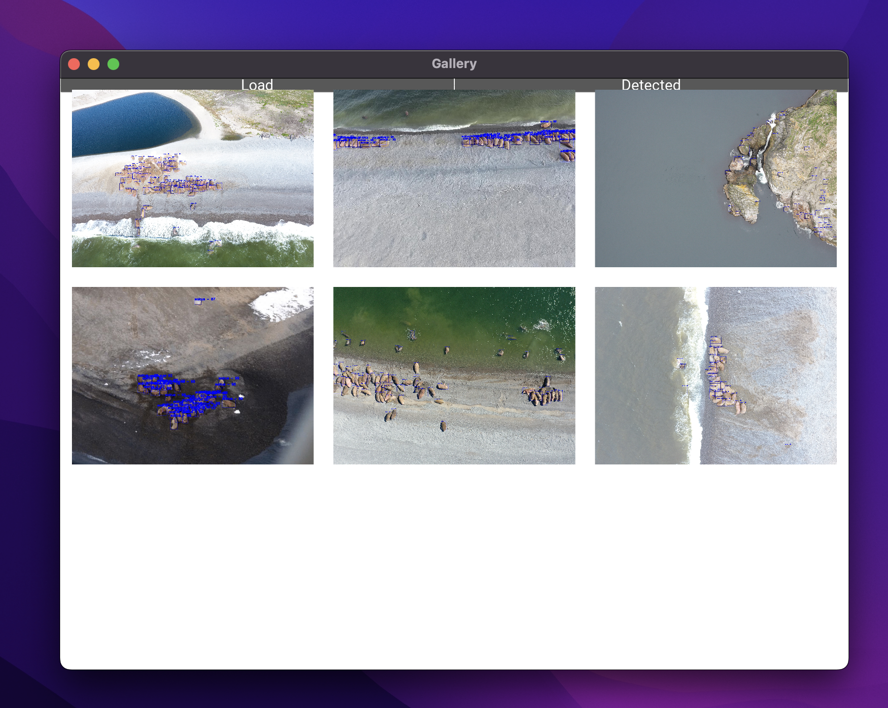

# habarovsk_hack
Репозиторий содержит решение к хакатону "ИИ на страже популяции Ненецких моржей"

## Описание 
Данная ветка содержит в себе приложение на ```kivy```, которое позволяет обрабатывать изображения и получать как результат изображения с уже отрисованными bboxes после модели

## Использование
- склонировать репозиторий 
- установить необходимые библиотеки:
    - ```pip install -r requirements.txt -f https://download.openmmlab.com/mmcv/dist/cu111/torch1.10.0/index.html```
    - Библиотека, которая позволяет работать моделям детекции:
    ```
    git clone https://github.com/open-mmlab/mmdetection.git
    cd mmdetection
    pip install -e .
    cd ../
    ```
- запустить приложение:
```
python app.py
```
## Пример работы приложения
- Запускаем приложение

- После запуска приложения мы можем выбрать ```Load``` для загрузки изображений, которые хотим распознать

- После обработки фотографий нашей моделью есть возможность просмотреть результаты работы 

- Также мы имеем возможность просмотра получившихся изображений в уже более детальном виде
